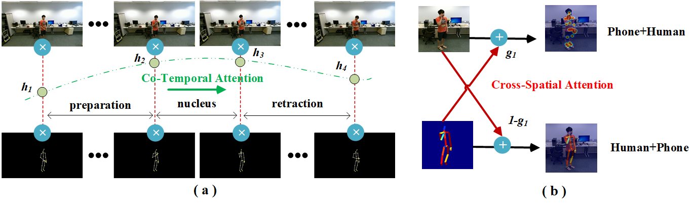
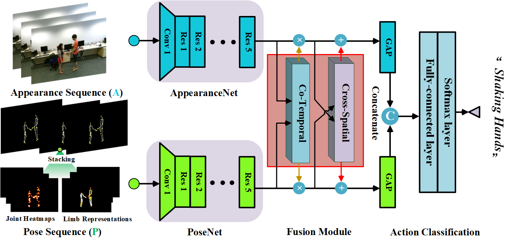
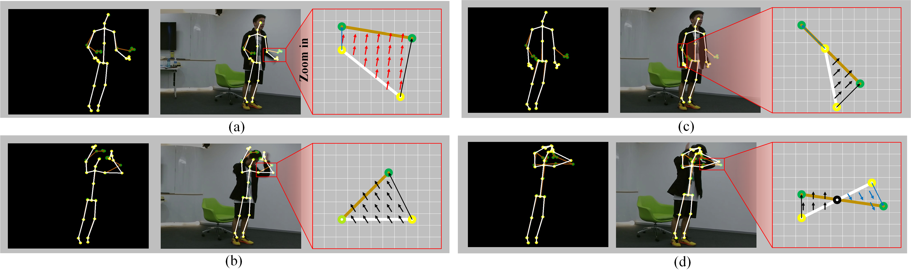
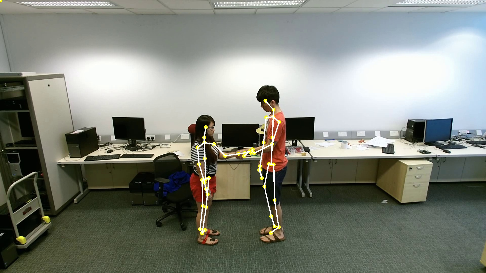
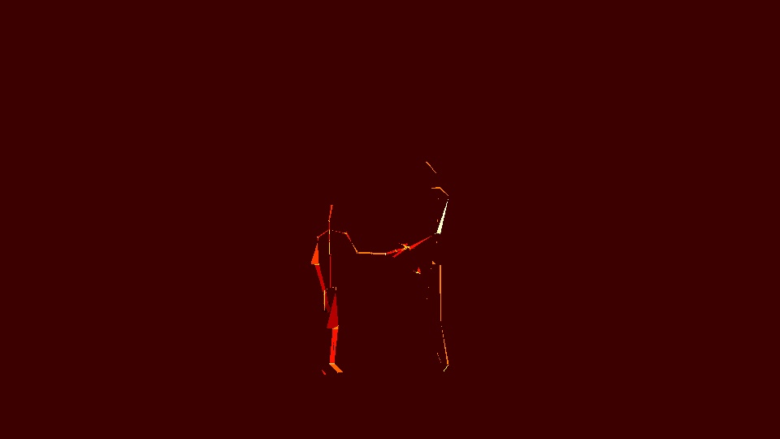

# B2C-AFM: Bi-directional Co-Temporal and Cross-Spatial Attention Fusion Model for Human Action Recognition

<p align="center">  
  
</p> 
<p align="center">  
  
</p>   

## Introduction  
This repo is official **[PyTorch](https://pytorch.org)** implementation of **[B2C-AFM: Bi-directional Co-Temporal and Cross-Spatial Attention Fusion Model for Human Action Recognition (TIP)](https://ieeexplore.ieee.org/abstract/document/10235872)**. 
  
  
## Directory  
### Root  
The `${ROOT}` is described as below.  
```  
${ROOT}  
|-- assets  
|-- common
|-- data  
|-- main
|-- output  
|-- tool
|-- vis  
```
* `assets` contains paper images .png.  
* `common` contains kernel codes for B2C.
* `data` contains data loading codes and soft links to images and annotations directories.    
* `main` contains high-level codes for training or testing the network.
* `output` contains log, trained models, visualized outputs, and test result.    
* `tool` contains a code to merge models of `rgb_only` and `pose_only` stages.
* `vis` contains some codes for visualization.  
  
### Running  
You need to follow directory structure of the `data` as described in IntegralAction **[Code](https://github.com/mks0601/IntegralAction_RELEASE)**  **[Paper](https://openaccess.thecvf.com/content/CVPR2021W/HVU/papers/Moon_IntegralAction_Pose-Driven_Feature_Integration_for_Robust_Human_Action_Recognition_in_CVPRW_2021_paper.pdf)**
Details on How to train and test our code can be found in **[Git Repository](https://github.com/mks0601/IntegralAction_RELEASE)**

### Demos
<p align="center">  
  
</p> 
<center class ="half">
 
  
</center> 

## Acknowledgements
We thank **[IntegralAction](https://github.com/mks0601/IntegralAction_RELEASE)** for their outstanding work.
## Reference  
```
@article{guo2023b2c,
  title={B2C-AFM: Bi-directional Co-Temporal and Cross-Spatial Attention Fusion Model for Human Action Recognition},
  author={Guo, Fangtai and Jin, Tianlei and Zhu, Shiqiang and Xi, Xiangming and Wang, Wen and Meng, Qiwei and Song, Wei and Zhu, Jiakai},
  journal={IEEE Transactions on Image Processing},
  year={2023},
  publisher={IEEE}
}  
@InProceedings{moon2021integralaction,
  title={IntegralAction: Pose-driven Feature Integration for Robust Human Action Recognition in Videos},
  author={Moon, Gyeongsik and Kwon, Heeseung and Lee, Kyoung Mu and Cho, Minsu},
  booktitle = {The IEEE Conference on Computer Vision and Pattern Recognition Workshop (CVPRW)}, 
  year={2021}
}
```


